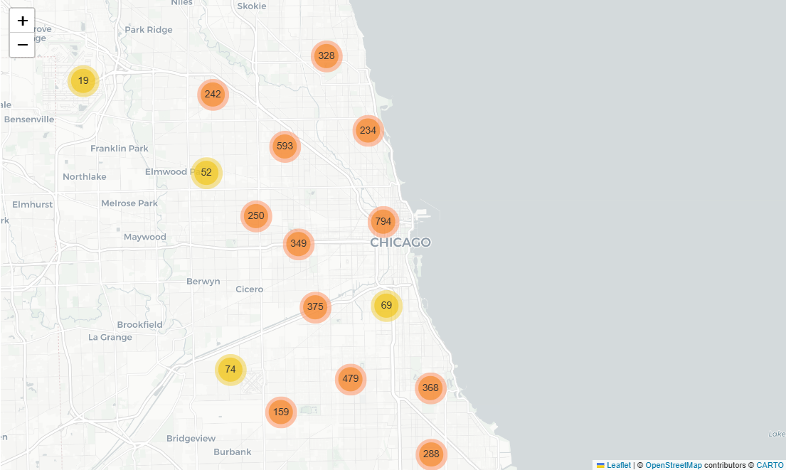
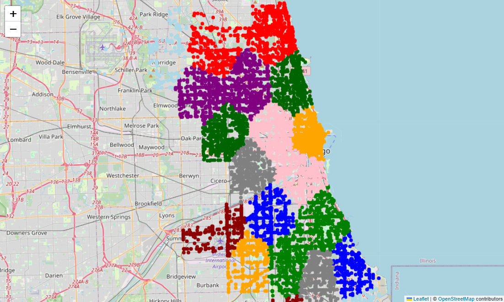

# Chicago Traffic Crash Analysis Dashboard

A Tableau dashboard built from a PySpark-based big data project that analyzes over 1 million real-world Chicago traffic crash records. The dashboard provides interactive visualizations to identify crash hotspots, temporal patterns, weather impacts, and major contributing causes of traffic accidents.

---

## Overview

Traffic safety is a growing urban concern. This project analyzes crash patterns across Chicago to uncover high-risk behaviors, peak crash hours, and environmental factors affecting crash severity.

The dashboard was built using aggregated outputs generated from a PySpark data processing pipeline.

---

## Dataset

**Source:** City of Chicago – Traffic Crashes Dataset

- Over **1.1 million** crash records
- Real-world public safety dataset
- Contains crash location, time, weather, road conditions, contributing causes, and injury information

---

## Technologies Used

- PySpark
- Apache Spark
- Spark MLlib
- Tableau
- Python
- Pandas

---

## Dashboard Visualizations

### Crash Hotspots
Displays crash locations across Chicago to identify accident-prone areas.

### Hourly Crash Trends
Shows how crash frequency changes throughout the day, highlighting peak traffic hours.

### Top 10 Contributing Causes
Ranks the leading causes responsible for traffic crashes.

### Crash Heatmap
Visualizes crash frequency by hour of the day and day of the week.

### Weather Impact
Compares crash frequency under different weather conditions.

### Feature Importance
Displays the most influential features used by the Random Forest model for crash severity prediction.

---

## Key Insights

- Crash frequency peaks during afternoon rush hours (3 PM – 6 PM).
- Early morning hours (2 AM – 5 AM) have the fewest crashes.
- Failure to yield right of way is the leading contributing cause.
- Rain and cloudy weather account for a significant number of crashes.
- Driver behavior contributes more strongly to crash severity than environmental conditions.

---

## Machine Learning

The underlying PySpark pipeline includes:

- Random Forest Classifier for crash severity prediction
- K-Means Clustering for identifying crash location clusters
- Feature Importance analysis for model interpretation

---

## Dashboard Preview

### Main Dashboard

---

## Tableau Workbook

The interactive Tableau dashboard is available here:

`tableau/Chicago_Traffic_Dashboard.twbx`

## Future Work

- Geo-spatial crash hotspot analysis
- Integration with weather, traffic volume, or construction data
- Real-time crash severity prediction system

